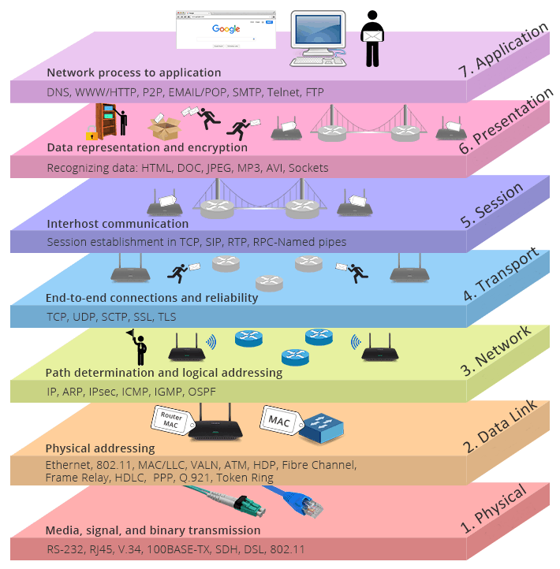

# OSI模型

## 应用层 Application
网络服务与用户的一个接口
  
应用层需要关心应用程序的逻辑细节（ 也就是我们场说的业务需求逻辑，） 而下面的几层更关心数据在网络的传输活动
 
比较常用得协议有 Http Https ...
## 表示层 Presentation
数据得表示,安全 压缩（在五层模型里已合并到应用层）
## 会话层 Session
建立 管理 终止会话 （在五层模型里已合并到应用层）
## 传输层 Transport
定义传输数据得协议端口号，以及流控和差错校验
## 网络层 Network
进行逻辑地址寻址，实现不同网络之间的路径选择
## 数据纳链路层 Data Link
建立逻辑链接。进行硬件地址寻址，差错校验等
## 物理层 physical
建立维护，断开物理链接
